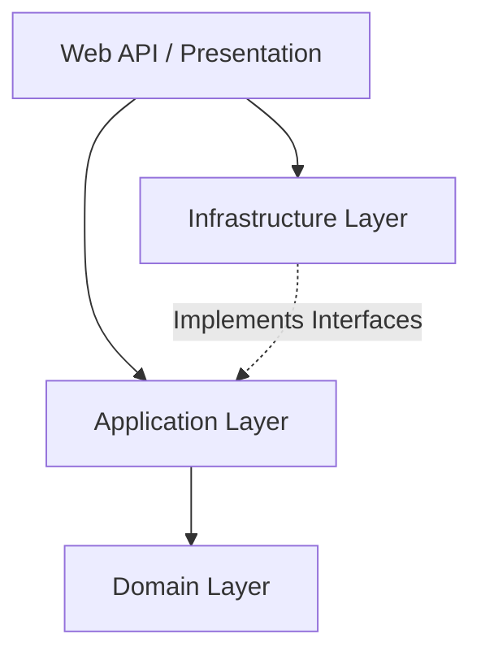

# 🚀 C# .NET 10 Clean Architecture & CQRS

Một dự án mẫu (Template/Demo) được xây dựng trên nền tảng **.NET 10**, áp dụng triệt để các tiêu chuẩn kỹ thuật phần mềm hiện đại như **Clean Architecture**, **CQRS** (Command Query Responsibility Segregation), và **Domain-Driven Design (DDD)**. 

Dự án này là minh chứng cho việc tổ chức mã nguồn có tính mở rộng cao, dễ bảo trì, dễ dàng thực hiện Unit Test và phân tách hoàn toàn Logic nghiệp vụ khỏi các công nghệ hạ tầng (Database, UI).

---

## 🏗️ Kiến Trúc Hệ Thống (Architecture)

Dự án được chia thành 4 Project vật lý (DLL) biệt lập, tuân thủ nguyên tắc Dependency Rule: **Dependencies only point inwards** (Sự phụ thuộc chỉ hướng vào lõi).



### 1. Domain (`DemoC#.Domain`)
- Chứa các thực thể (Entities), Enum, Exceptions và các đối tượng giá trị (Value Objects) mang tính cốt lõi.
- Hoàn toàn KHÔNG phụ thuộc vào bất kỳ thư viện bên ngoài nào.
- *Ví dụ: Class `Product`, kiểu dữ liệu bất biến `Money`.*

### 2. Application (`DemoC#.Application`)
- Chứa toàn bộ Logic nghiệp vụ (Use Cases) được định nghĩa dưới dạng **CQRS** (Commands/Queries) thông qua thư viện **MediatR**.
- Chứa các giao diện (Interfaces) như `IApplicationDbContext`.
- KHÔNG biết về Database hay Framework web.

### 3. Infrastructure (`DemoC#.Infrastructure`)
- Đóng vai trò thực thi (Implementation) các Interfaces được định nghĩa ở tầng Application.
- Tương tác với Cơ sở dữ liệu thông qua **Entity Framework Core** và **PostgreSQL**.

### 4. Presentation / API (`DemoC#`)
- Lớp vỏ ngoài cùng, chịu trách nhiệm nhận HTTP Requests và trả về JSON Responses.
- Đóng vai trò là **Composition Root** (Lắp ráp Dependency Injection tại `Program.cs`).
- Tích hợp **Scalar UI** & OpenAPI để sinh tài liệu API siêu trực quan.

---

## 🛠️ Công Nghệ Sử Dụng

- **Framework:** .NET 10.0
- **Ngôn ngữ:** C# 13 (sử dụng tính năng `record`, `pattern matching`, nullable reference types)
- **Database:** PostgreSQL
- **ORM:** Entity Framework Core 10.0.12 (Code-First Migration)
- **Design Patterns:** CQRS, Mediator Pattern, Dependency Injection, DDD (Value Object, Domain Event)
- **Thư viện chính:**
  - `MediatR`: Điều phối Commands & Queries.
  - `FluentValidation`: Kiểm tra tính hợp lệ của dữ liệu đầu vào thông qua Pipeline Behavior.
  - `Npgsql.EntityFrameworkCore.PostgreSQL`: Driver kết nối DB.
  - `Microsoft.AspNetCore.OpenApi` + `Scalar`: Render tài liệu API.

---

## 🚀 Hướng Dẫn Cài Đặt & Chạy Dự Án

### Yêu Cầu Hệ Thống (Prerequisites)
- [Bắt buộc] Cài đặt **.NET 10 SDK** trở lên.
- [Bắt buộc] Đã cài đặt và chạy máy chủ cơ sở dữ liệu **PostgreSQL** (hoặc dùng Docker).

### Bước 1: Cấu hình Chuỗi kết nối (Connection String)
Mở file `appsettings.json` trong project `DemoC#` (API) và cập nhật đường dẫn kết nối PostgreSQL của bạn:
```json
"ConnectionStrings": {
    "DefaultConnection": "Host=localhost;Database=DemoC_Db;Username=postgres;Password=matkhaucua_ban"
}
```

### Bước 2: Cập nhật Database (Migration)
Mở Terminal tại thư mục gốc của dự án và chạy lệnh sau để EF Core tự tạo bảng trong Database:
```bash
dotnet ef database update --project DemoC#.Infrastructure --startup-project DemoC#
```

### Bước 3: Khởi động Dự Án
Chạy ứng dụng bằng lệnh:
```bash
dotnet run --project DemoC#
```
Trình duyệt sẽ tự động mở lên tại địa chỉ: `https://localhost:<port>/scalar/v1` hiển thị giao diện tài liệu API tuyệt đẹp.

---

## 🧪 Luồng Đi Của Một Request (Ví dụ: Thêm Sản Phẩm)
1. Controller nhận JSON Body.
2. JSON được ánh xạ thành biến `AddProductCommand` (kiểu record bất biến).
3. `FluentValidation` tự động chặn lại nếu giá tiền âm hoặc trống tên (trả về lỗi 400 ProblemDetails).
4. `MediatR` tìm đúng hàm `Handle()` trong `AddProductCommandHandler`.
5. Khởi tạo Domain Entity `Product` thông qua Factory Method.
6. `IApplicationDbContext` lưu dữ liệu và gọi `SaveChangesAsync()`.
7. Trả về `ProductResponseDto` (HTTP 201 Created).

---

## 📜 Giấy Phép (License)
Dự án được phân phối dưới giấy phép MIT. Xem file `LICENSE` để biết thêm chi tiết.
