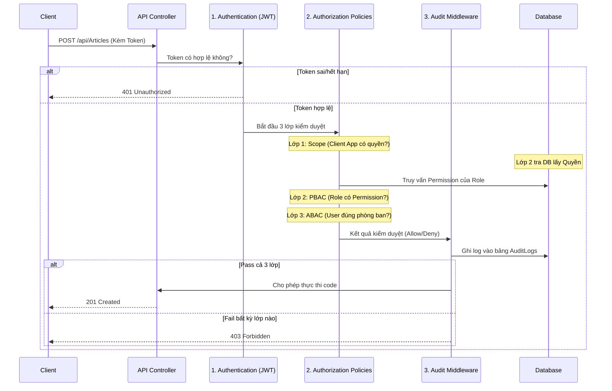

# 🛡️ Hướng dẫn chi tiết: Hệ thống Authentication & Authorization (Zero Trust)

Trong kiến trúc của dự án DemoC#, luồng bảo mật được tách bạch rõ ràng giữa **Authentication** (Xác thực danh tính) và **Authorization** (Phân quyền truy cập). Hệ thống áp dụng triết lý **Zero Trust** (Không tin tưởng bất kỳ ai) bằng cách xây dựng một bộ lọc 4 lớp kết hợp với **Vòng đời Token siêu bảo mật**.

Dưới đây là tài liệu kiến trúc chi tiết cách hệ thống được lập trình.

---

## 🚦 Luồng hoạt động (Zero Trust Pipeline)

---

## 1. Authentication (Xác Thực & Vòng Đời Token)

Authentication được triển khai tiêu chuẩn bằng **JWT Bearer Authentication**, kết hợp với cơ chế **Refresh Token qua HttpOnly Cookie** nhằm triệt tiêu lỗ hổng XSS và CSRF.

### 1.1 Cấu trúc JWT Token (Chống JWT Bloat)
Nhằm giải quyết triệt để lỗi **JWT Bloat** (hiện tượng quá tải header HTTP), hệ thống ép Token phải cực mỏng bằng cách chỉ nhúng đúng 4 trường quan trọng vào JWT Payload:
- `sub`: User ID.
- `role`: Tên vai trò (VD: "Writer").
- `department`: Phòng ban (VD: "News").
- `scope`: Phạm vi Client App.

### 1.2 Tiêu chuẩn Vàng Lưu trữ Token
1. **Access Token siêu ngắn hạn:** Thời gian sống (`Expires`) được gọt xuống chỉ còn **15 phút**. Nó được trả về trong thân JSON (`Response Body`) để Client lưu trên RAM (In-memory state), tuyệt đối an toàn trước mã độc đánh cắp File/LocalStorage.
2. **Refresh Token ngẫu nhiên:** Được sinh ra bằng chuẩn mã hóa (CSPRNG), lưu xuống bảng `UserRefreshTokens` (kèm thông tin DeviceId để quản lý đa thiết bị). 
3. **Cơ chế Cookie:** Refresh Token được Server nhúng vào Headers qua lệnh Set-Cookie đạt chuẩn: `HttpOnly` (Giấu khỏi Javascript), `Secure` (Chỉ chạy trên HTTPS), và `SameSite=Strict` (Chống lừa đảo CSRF). 

*Khi Access Token 15 phút hết hạn, Client gọi API ngầm `/api/auth/refresh-token`, trình duyệt tự đính kèm HttpOnly Cookie vào request để hệ thống cấp lại Access Token mới.*

---

## 2. Authorization (Phân Quyền Zero Trust - Mày được làm gì?)

Đây là "đặc sản" của dự án này. Hệ thống áp dụng cơ chế Policy-Based kết hợp 4 lớp, được code tại `DemoC#.Infrastructure/Auth/AuthHandlers.cs`.

### Lớp 1: Tầng Ứng Dụng (Scope Check)
- **Class xử lý:** `ScopeRequirement` và `ScopeAuthorizationHandler`.
- **Mục đích:** Để gọi API, token phải chứa Claim `scope` hợp lệ (VD: `news.write`). Lớp này dùng để giới hạn quyền của ứng dụng gọi API (OAuth2 Client), chứ không phải của User.

### Lớp 2: Tầng Người Dùng (PBAC - Permission Check)
- **Class xử lý:** `PermissionRequirement` và `PermissionAuthorizationHandler`.
- **Sự lợi hại:** Thay vì phình to Token, Middleware lớp 2 sẽ đọc Role từ Token, sau đó tự động chọc xuống bảng `AspNetRoleClaims` của Identity trong DB (thông qua `RoleManager`) để tra cứu xem Vai trò đó có cầm quyền `articles:create` hay không. Kết hợp hoàn hảo giữa độ nhẹ của Token và độ chính xác của DB.

### Lớp 3: Tầng Ngữ Cảnh (ABAC - Attribute-Based Check)
- **Class xử lý:** `ArticleAbacRequirement` và `ArticleAbacHandler`.
- **Mục đích:** Đây là quyền động (Dynamic). Nó kiểm tra các **thuộc tính (attributes)** của user ở thời điểm hiện tại. 
- *Ví dụ:* Hàm `HandleRequirementAsync` sẽ lấy claim `department` của User từ bộ nhớ RAM (vì đã có sẵn trong Token). Kể cả user qua được Lớp 2, nhưng nếu department không phải là "News", request vẫn bị từ chối.

### Lớp 4: Lớp Ghi Vết (Audit Logging)
- **Class xử lý:** `CustomAuthorizationMiddlewareResultHandler`.
- **Mục đích:** Implement từ interface `IAuthorizationMiddlewareResultHandler` của ASP.NET Core. 
- **Cách thức hoạt động:** Middleware này "hứng" kết quả kiểm duyệt cuối cùng, tự động dịch ngược lý do (VD: Fail ở Scope, Fail ở PBAC) và ghi vết (Log) xuống PostgreSQL bảng `AuditLogs` trước khi trả 403 về cho Client.
