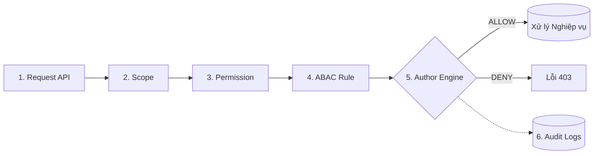
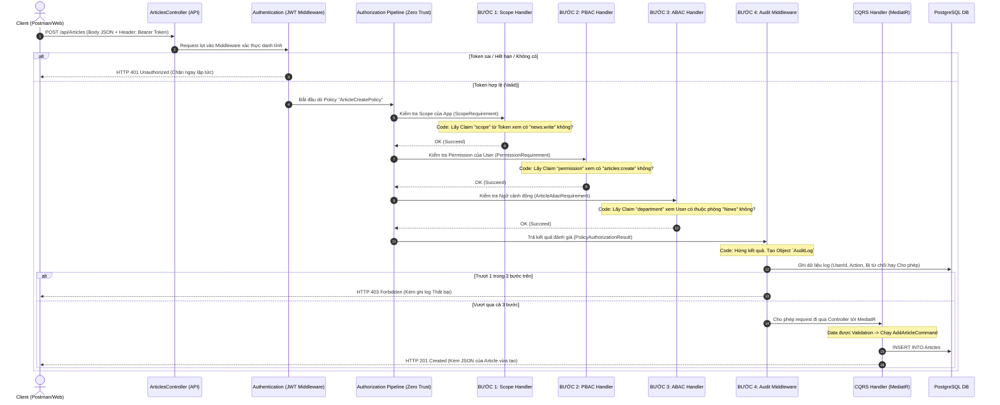

# 📝 KỊCH BẢN THUYẾT TRÌNH (PITCH DECK SCRIPT): NEWS MANAGEMENT & ZERO TRUST CLEAN ARCHITECTURE

> **Mục tiêu:** Trình bày dự án một cách chuyên nghiệp, từ kiến trúc tổng thể, giải pháp bảo mật phân quyền đa lớp (Zero Trust), đến triển khai (Docker/DevOps), và cuối cùng là Demo thực tế.

---

## PHẦN 1: GIẢI PHÁP BẢO MẬT & PHÂN QUYỀN (Zero Trust)

*(Đọc Script thuyết trình)*
*"Kính thưa Hội đồng, bài toán hóc búa nhất của các hệ thống doanh nghiệp không phải là làm sao để lưu trữ dữ liệu, mà là làm sao để **BẢO VỆ** dữ liệu đó. Hôm nay, em xin trình bày cách hệ thống News Management của chúng ta giải quyết bài toán này thông qua đường ống bảo mật Zero Trust 4 lớp."*

### 1.1. Các Mô hình Phân quyền Cổ điển & Hạn chế
*(Trình bày nhanh sự tiến hóa của phân quyền để làm nổi bật giải pháp của mình)*

1. **RBAC (Role-Based):** Phân quyền theo Role (Admin, User). Rất dễ làm nhưng quá cứng nhắc. Một User có thể làm rất nhiều việc không lường trước được.
2. **PBAC (Permission-Based):** Phân quyền theo Hành động (VD: `articles:create`). Chi tiết hơn RBAC, nhưng vẫn chưa giải quyết được bài toán Sở hữu (Ví dụ: Được quyền sửa bài, nhưng lại đi sửa bài của người khác!).
3. **ABAC (Attribute-Based):** Phân quyền theo Thuộc tính động (VD: Chỉ sửa bài NẾU bạn thuộc phòng "News"). Rất mạnh, nhưng code rất phức tạp.

### 1.2. Giải pháp thực tế: Kiến trúc Phân quyền Đa lớp (Zero Trust Pipeline)

*Lập luận cốt lõi của em là: **Không có mô hình đơn lẻ nào là hoàn hảo**. Do đó, kiến trúc em áp dụng là sự **KẾT HỢP** những điểm mạnh nhất của các mô hình trên.*

#### Sơ đồ Tuần tự (Sequence Diagram) - Mô phỏng Luồng gọi API thực tế:
*Dưới đây là sơ đồ chi tiết diễn giải 1 luồng gọi API (Thêm bài báo) sẽ bị kiểm tra gắt gao như thế nào trước khi được lọt vào Hệ thống:*

#### Phân tích Ưu điểm tột đỉnh:
- Kể cả khi Hacker trộm được Token của Giám đốc, mang lên thiết bị lạ (Vi phạm Scope) -> Bị chặn.
- Vượt qua Scope, định sửa bài của người khác (Vi phạm ABAC) -> Bị chặn.
- Mọi lịch sử tấn công đều bị Audit Log ghi lại không thể chối cãi!

---

## PHẦN 2: BÀI TOÁN QUẢN LÝ TIN TỨC (Nghiệp vụ cốt lõi)

*(Đọc Script thuyết trình)*
*"Kính thưa Hội đồng, sau khi đã xây dựng xong bức tường thành bảo mật vững chắc ở Phần 1, việc triển khai nghiệp vụ cốt lõi ở Phần 2 trở nên vô cùng rõ ràng và trơn tru.*

*Hệ thống Tin tức được thiết kế với các thực thể cốt lõi như `Article` và `Category`. Nhờ có kiến trúc Author Engine Đa lớp chặn ở vòng ngoài, trải nghiệm của lập trình viên (Developer Experience) khi code các API này là cực kỳ tuyệt vời!*

*Code C# bên trong Controller của chúng em hiện tại vô cùng 'Sạch' (Clean Code). Chúng em hoàn toàn không phải viết bất kỳ câu lệnh `if-else` lặp đi lặp lại nào để kiểm tra xem User có quyền sửa bài không. Mọi rác rưởi logic đó đã được màng lọc ABAC và PBAC lo liệu.*

*Lập trình viên lúc này chỉ tập trung 100% chất xám vào Logic Kinh Doanh thông qua **CQRS và MediatR** để Thêm, Sửa, Xóa tin tức một cách tối ưu nhất."*

---

## PHẦN 3: ĐÓNG GÓI ỨNG DỤNG (Containerization với Docker)

### 3.1. Tác dụng của Docker?
*Nỗi ám ảnh lớn nhất của các lập trình viên là: **"Code chạy rất ngon trên máy của em, nhưng khi đưa lên Server thì lại sập!"**. Nguyên nhân là do lệch phiên bản Hệ điều hành hoặc cài đặt môi trường sai.*

*Docker đóng gói toàn bộ Mã nguồn (Code) + Môi trường chạy (.NET Runtime) + Cấu hình... vào chung một cái hộp duy nhất (Image). Cái hộp này khi bê đi máy Mac, máy Windows, hay lên Cloud Linux thì đều chạy chính xác 100% giống hệt nhau.*

### 3.2. Docker Multi-stage Build
Trong dự án này, em đã viết file `Dockerfile` áp dụng kỹ thuật **Multi-stage Build**. Tức là: Dùng image `sdk` (hàng GB) để compile code ra file chạy, sau đó chỉ copy những file chạy đó sang một image `aspnet` (chỉ chứa runtime). Kết quả là dung lượng hệ thống giảm từ 1GB xuống chỉ còn khoảng 200MB!

---

## PHẦN 4: LIVE DEMO (Showtime)
- **Bước 1 (DevOps):** Gõ `docker-compose up -d`. Vài giây sau, hệ thống đứng dậy thành công.
- **Bước 2 (Kiểm chứng Zero Trust Pipeline):** 
  1. *Test Scope:* Gọi API bằng Token của App Khách -> Chặn ngay cửa số 1.
  2. *Test PBAC:* Login tài khoản `Reader` -> Bị chặn ở cửa 2 (Thiếu Permission).
  3. *Test ABAC:* Login `Writer`, truyền láo ID bài báo của người khác -> Lọt cửa 2, bị chặn cửa 3.
  4. *Thành công:* Viết bài bằng đúng tài khoản và phòng ban -> `201 Created`. Lịch sử Audit ghi log hoàn chỉnh.

> **KẾT LUẬN:** *"Hệ thống đã giải quyết trọn vẹn từ bảo mật vòng ngoài, logic phân quyền Đa lớp bên trong (Zero Trust), kiến trúc siêu sạch CQRS, cho đến quy trình đóng gói tự động hóa DevOps. Em xin kết thúc bài trình bày ở đây."*
