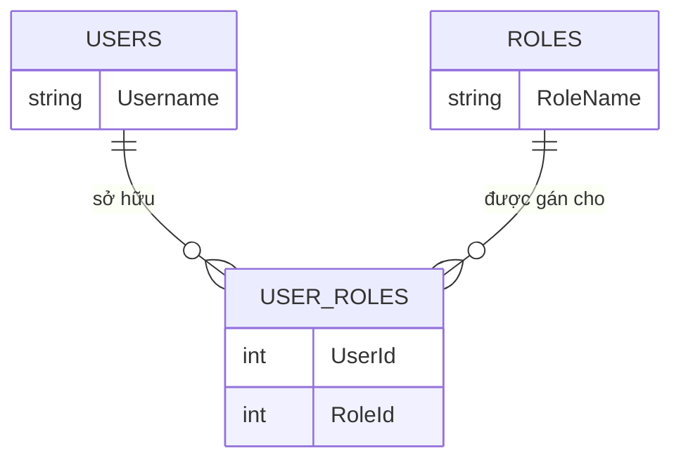
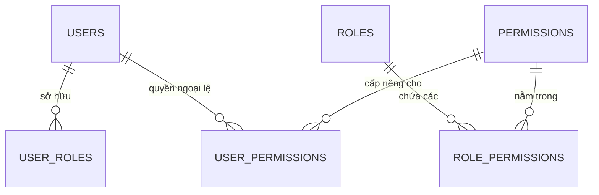
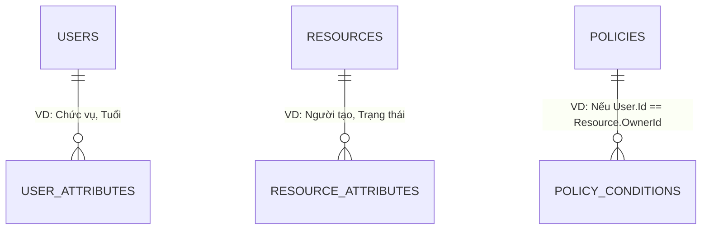
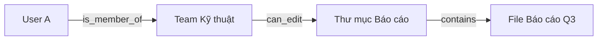
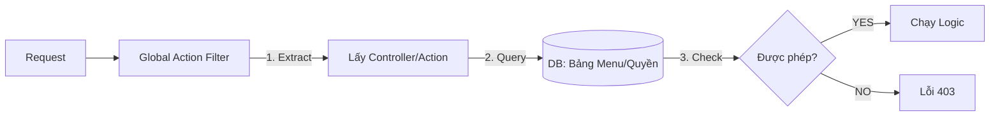
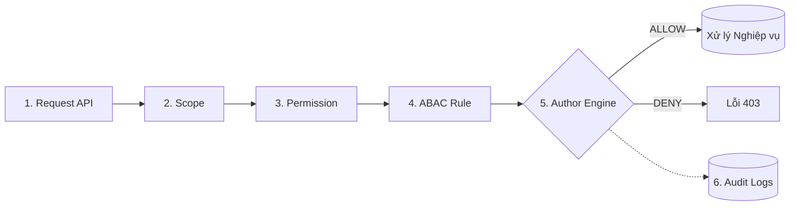

# 🚀 KỊCH BẢN THUYẾT TRÌNH BẢO MẬT & KIẾN TRÚC
**Chủ đề: Từ Code đến Container - Xây dựng & Triển khai Hệ thống Quản lý Tin tức chuẩn Enterprise**

---

## TỔNG QUAN HỆ THỐNG (Giới thiệu)
*Kính chào quý thầy cô / các anh chị. Hôm nay em xin trình bày về dự án Hệ thống Quản lý Tin tức.*
*Hệ thống này được xây dựng trên .NET Core API và Docker. Tuy nhiên, điểm nhấn lớn nhất mà em muốn tập trung phân tích hôm nay không phải là các chức năng Thêm/Sửa/Xóa thông thường, mà là **Kiến trúc Bảo mật và Phân quyền** - trái tim của mọi hệ thống chuẩn Enterprise.*

---

## PHẦN 1: BÀI TOÁN BẢO MẬT & PHÂN QUYỀN (Authentication & Authorization)

### 1.1. Định danh (Authentication - Xác thực người dùng)
*Để xác định "Người đang truy cập là ai?", chúng ta dùng 2 phương pháp là Session/Cookie và JWT. Trong dự án này, em chọn JWT vì những lý do sau:*

- **Mô hình Session/Cookie truyền thống:** Khi User đăng nhập, Server tạo ra 1 "phiên" (Session) lưu trên RAM của Server, và trả về cho trình duyệt một ID (Cookie). 
  - *Nhược điểm:* Rất nặng Server. Nếu trang báo có 100.000 người online, RAM Server sẽ cạn kiệt. Việc mở rộng (Scale) ra nhiều Server rất khó vì phải đồng bộ Session.
- **Mô hình JWT (JSON Web Token):** Đây là thẻ định danh không trạng thái (Stateless).
  - *Cấu trúc của JWT gồm 3 phần:*
    1. **Header (Đầu):** Chứa thông tin về thuật toán mã hóa (VD: HS256).
    2. **Payload (Thân):** Chứa thông tin của User (ID, Email, Quyền hạn...). Phần này ai cũng có thể giải mã để đọc, nên tuyệt đối không lưu mật khẩu ở đây.
    3. **Signature (Chữ ký):** Được Server băm ra bằng một "Chìa khóa bí mật" (Secret Key). Bất kỳ ai sửa đổi Payload thì Chữ ký sẽ bị sai lệch.
  - *Ví dụ thực tế:* JWT giống như "Căn cước công dân" có đóng dấu chìm của Nhà nước. Đi qua trạm gác (API), bảo vệ chỉ cần nhìn cái dấu chìm (Signature) là biết căn cước thật hay giả, không cần phải gọi điện về trụ sở (Database) để tra cứu hồ sơ nữa. Điều này giúp Server giảm tải cực lớn!

### 1.2. Sự tiến hóa của các mô hình Phân quyền (Authorization)
*Nếu Authentication (Định danh) là việc cấp "Chìa khóa" để bước qua cổng công ty, thì **Authorization (Phân quyền)** là việc quyết định anh được phép đi vào những căn phòng nào và làm gì trong công ty đó.*

*Việc phân quyền không đơn giản là kiểm tra if-else. Để tìm ra kiến trúc tối ưu nhất, ngành kỹ thuật phần mềm đã trải qua sự tiến hóa với 4 mô hình sau:*

#### Mô hình 1: RBAC (Role-Based Access Control) - Phân quyền theo Vai trò
RBAC là mô hình kinh điển nhất. Chúng ta gom người dùng vào các nhóm (Role) như `Admin`, `User`, `Manager`. Quyền truy cập được cấp cho tập thể Role thay vì từng cá nhân.

- **Bản chất:** Gắn cứng quyền truy cập vào một "Chức danh". (VD: `[Authorize(Roles="Writer")]`).
- **Ưu điểm (Dễ triển khai):** Cực kỳ dễ code, dễ hiểu. Phù hợp cho các dự án nhỏ, nội bộ, ít biến động.
  - *Dẫn chứng:* Khi phòng Nhân sự tuyển 10 phóng viên mới, Admin chỉ cần gán cả 10 người vào Role `Writer` là xong. Code API rất đơn giản.
- **Nhược điểm (Sự cứng nhắc & Role Explosion):**
  - *Dẫn chứng:* Giả sử có 1 Thực tập sinh mảng nội dung cần quyền "Duyệt bài" tạm thời trong 1 tuần. Lập trình viên không thể gán Role "Giám đốc" cho cậu ta. Buộc phải tạo ra một Role lai tạp là `ThucTapSinh_DuocDuyetBai`. Hệ thống dùng 5 năm sẽ đẻ ra hàng trăm Role rác, code C# ngập tràn các lệnh if-else rối rắm.

**💻 Demo Code:**
```csharp
// Đơn giản chỉ cần gắn Attribute lên Controller hoặc Action
[Authorize(Roles = "Admin, Manager")]
[HttpPost("create-article")]
public IActionResult CreateArticle() 
{ 
    return Ok("Thêm bài viết thành công!");
}
```

#### Mô hình 2: PBAC (Permission-Based Access Control) - Phân quyền theo Hành động
Khắc phục RBAC, ta bẻ nhỏ hệ thống thành các Quyền (Permission) như `articles:create`, `articles:delete`. Bạn có Permission nào thì làm được việc đó, bất kể bạn là sếp hay nhân viên.

- **Bản chất:** Không kiểm tra Chức danh, mà kiểm tra "Giấy phép" (`[HasPermission("Approve_News")]`). Role lúc này chỉ là cái vỏ gom nhóm. Bảng `USER_PERMISSIONS` sinh ra để giải quyết quyền ngoại lệ.
- **Ưu điểm (Linh hoạt tuyệt đối):**
  - *Dẫn chứng:* Sếp yêu cầu cấp quyền duyệt bài cho Thực tập sinh. Admin chỉ cần mở giao diện Web, tích vào ô "Approve_News" riêng cho tài khoản đó (Lưu vào `USER_PERMISSIONS`). **Mã nguồn C# không thay đổi một dòng nào, không cần Rebuild Server!**
- **Nhược điểm (Mù lòa về dữ liệu - Data Blindness):**
  - *Dẫn chứng:* Nhân viên A và Nhân viên B đều có quyền `Edit_News`. Nhân viên A có thể bắt gói tin API, đổi ID bài viết và **SỬA BÀI CỦA NHÂN VIÊN B**. PBAC không biết cách phân biệt "Bài của ai", dẫn đến lỗ hổng bảo mật nghiêm trọng (IDOR).

**💻 Demo Code:**
```csharp
// 1. Khai báo Policy ở Program.cs
builder.Services.AddAuthorization(options =>
{
    options.AddPolicy("CanCreateArticle", policy => 
        policy.RequireClaim("permission", "articles:create"));
});

// 2. Sử dụng ở Controller (Không cần quan tâm tới Role nữa)
[Authorize(Policy = "CanCreateArticle")]
[HttpPost("create-article")]
public IActionResult CreateArticle() { ... }
```

#### Mô hình 3: ABAC (Attribute-Based Access Control) - Phân quyền theo Thuộc tính

- **Bản chất:** Đánh giá quyền dựa trên 4 Thuộc tính: User, Dữ liệu, Hành động, Môi trường.
- **Ưu điểm (Kiểm soát siêu mịn - Fine-grained):**
  - *Dẫn chứng:* Giải quyết hoàn toàn nhược điểm của PBAC. Bộ luật ABAC quy định: `Chỉ cho UPDATE NẾU User.Id == Article.AuthorId`. Ngay lập tức, Nhân viên A không thể sửa bài của Nhân viên B nữa.
- **Nhược điểm (Sát thủ hiệu năng & Phức tạp):**
  - *Dẫn chứng:* Để duyệt 1 request, hệ thống phải query DB lấy thuộc tính User, query DB lấy thuộc tính Bài viết, check đồng hồ Server, rồi chạy Engine logic. Gây trễ (latency) lớn và cực kỳ khó setup Database cho linh hoạt.

**💻 Demo Code (ABAC Handler):**
```csharp
// Lớp ABAC Handler - Xử lý nghiệp vụ động (Ví dụ: Kiểm tra phòng ban của User)
protected override Task HandleRequirementAsync(AuthorizationHandlerContext context, ArticleAbacRequirement req)
{
    var userDept = context.User.FindFirst("department")?.Value;
    if (userDept == req.RequiredDepartment) 
    {
        context.Succeed(req); // Vượt ải!
    }
    return Task.CompletedTask;
}
```

#### Mô hình 4: ReBAC (Relationship-Based Access Control)

- **Bản chất:** Phân quyền dựa trên Đồ thị mối quan hệ (Cơ chế Google Zanzibar).
- **Ưu điểm (Đỉnh cao bài toán Chia sẻ):**
  - *Dẫn chứng:* Khi dùng Google Drive, bạn share 1 Thư mục cha cho 100 người, thì hàng ngàn thư mục con bên trong lập tức ăn theo quyền mà không bị lag.
- **Nhược điểm (Overkill):**
  - *Dẫn chứng:* Hệ thống Tin tức thường phẳng (Phóng viên viết -> Sếp duyệt), không có tính chất chia sẻ lồng nhau (nesting) như Drive. Dùng ReBAC ở đây là lãng phí tài nguyên hạ tầng.

**💻 Demo Code (Mô phỏng gọi tới Engine ReBAC bên ngoài như SpiceDB/Auth0 FGA):**
```csharp
// ReBAC không tự xử lý bằng code if-else mà hỏi Engine Đồ thị qua API
public async Task<bool> CheckRebacPermission(string userId, string action, string resourceId)
{
    // Tạo câu hỏi: "User A có quyền duyệt trên Bài viết B không?"
    var request = new CheckRequest {
        User = $"user:{userId}",
        Relation = action,
        Object = $"article:{resourceId}"
    };
    
    // Gửi request tới máy chủ Zanzibar và đợi trả về True/False
    var response = await _rebacClient.CheckAsync(request);
    return response.Allowed; 
}
```

#### 🔍 Phương pháp cài đặt bổ trợ: Phân quyền Động theo Controller/Action
*Đây là một **Kỹ thuật Hiện thực hóa (Implementation Approach)** vô cùng thực tiễn, có thể bóc tách thành 3 tầng cấu trúc:*

1. **Về Mô hình Cốt lõi (Extended RBAC - Phân quyền hạt mịn Fine-Grained):** Thay vì chỉ check Role thô như `Admin`, mô hình này bẻ nhỏ quyền hạn đến từng hành động. Controller đại diện cho *Tài nguyên*, Action đại diện cho *Thao tác* (Thêm/Sửa/Xóa).
2. **Về Cơ chế Quản lý (Dynamic Authorization - Dữ liệu dẫn dắt):** Thay vì hard-code tĩnh `[Authorize(Roles="Admin")]` (cứ sửa quyền là phải build lại code), kỹ thuật này đẩy toàn bộ luật xuống Database. Quản trị viên có thể tùy ý cấp/tước quyền trên giao diện mà không cần chạm vào mã nguồn.
3. **Về Kỹ thuật ASP.NET Core:** Sự kết hợp hoàn hảo giữa **Policy-Based Authorization** (tách logic bảo mật ra khỏi Controller) và **Routing Metadata** (tự động bóc tách Tên Controller & Action từ Request) để chạy qua một "Cửa khẩu" duy nhất (Global Filter).
- **Sơ đồ Pipeline (Luồng xử lý):**

- **Ưu điểm (Cấu hình động trên UI):** Quản trị viên có màn hình ma trận checkbox để cấp quyền cho từng màn hình, từng nút bấm một cách linh hoạt mà không cần Rebuild Server.
- **Nhược điểm (Mỏng manh & Nút thắt cổ chai):**
  - *Dễ vỡ (Fragile Code):* Dev vui tay đổi tên `ArticleController` thành `NewsController`, toàn bộ Database gãy cấu hình, lỗi 403 hàng loạt.
  - *Hiệu năng thảm họa:* Mọi Request đều phải call thêm 1 lệnh Query xuống Database.
  - *Mù lòa dữ liệu (Data Blindness):* Tương tự PBAC, không biết User đang sửa bài của ai, dẫn đến nguy cơ lỗi bảo mật IDOR.

**💻 Demo Code (Global Filter):**
```csharp
public class PermissionAuthorizationFilter : IAsyncAuthorizationFilter
{
    public async Task OnAuthorizationAsync(AuthorizationFilterContext context)
    {
        // 1. Lấy thông tin Controller & Action từ Route hiện tại
        var controller = context.ActionDescriptor.RouteValues["controller"];
        var action = context.ActionDescriptor.RouteValues["action"];
        var userId = context.HttpContext.User.FindFirst("sub")?.Value;
        
        // 2. Query xuống Database kiểm tra (Nút thắt cổ chai)
        bool hasPermission = await _dbContext.CheckUserPermission(userId, controller, action);
        
        // 3. Phán quyết
        if (!hasPermission) context.Result = new ForbidResult();
    }
}
```

#### 📊 Bảng so sánh tổng hợp đa chiều
| Tiêu chí | RBAC (Role) | PBAC (Permission) | ABAC (Attribute) | ReBAC (Relationship) | Dynamic Filter (Controller) | Giải pháp Zero Trust |
| :--- | :--- | :--- | :--- | :--- | :--- | :--- |
| **1. Bản chất hoạt động** | Gắn cứng Role vào mã nguồn | Cấp quyền dựa trên Hành động | Đánh giá điều kiện Thuộc tính | Duyệt Đồ thị quan hệ | Bắt theo tên Route (Controller/Action) | Phối hợp màng lọc Đa lớp |
| **2. Độ chi tiết (Granularity)** | **Thô** (Chỉ gom nhóm là "Admin", không rõ được gọi API nào) | **Mịn** (Biết rõ được phép gọi API Create, nhưng cấm API Delete) | **Siêu mịn** (Cùng API Edit, nhưng chỉ được sửa "Bài của mình") | **Mịn** (Quyền lan truyền tự động theo thư mục cha-con) | **Mịn** (Bắt chính xác từng đường dẫn URL, từng nút bấm) | **Toàn diện** (Kiểm soát từ thiết bị, hành động, đến dữ liệu) |
| **3. Khi thay đổi quyền hạn** | **Phải sửa Code & Rebuild** (Do Role bị hardcode) | **Đổi trên DB** (Có tác dụng ngay không cần Rebuild) | **Cấu hình Policy** (Linh hoạt theo logic code) | **Cấu hình trên SaaS** (Giao diện đồ thị ngoài) | **Tích chọn trên UI** (Lưu Database không cần Rebuild) | **Động 100%** (Đổi trên DB & Policy linh hoạt) |
| **4. Độ linh hoạt (Xử lý ngoại lệ)** | **Rất Kém** (Bị bó cứng theo chức danh, khó cấp quyền dị biệt) | **Khá** (Có thể cấp quyền lẻ cho từng User ngoài nhóm) | **Tuyệt đối** (Dễ dàng code các luật kinh doanh kỳ lạ nhất) | **Cao** (Xử lý gọn bài toán chia sẻ ngang hàng/thừa kế) | **Khá** (Tùy biến cấp/tước quyền trên UI nhanh chóng) | **Tối đa** (Đáp ứng mọi rule từ tĩnh đến động) |
| **5. Hiệu năng (Performance)** | 🚀 **Rất nhanh** (Chỉ check chuỗi Role trong Token) | 🚀 **Nhanh** (Quyền được cache vào JWT Token) | ⚠️ **Chậm** (Phải query DB lấy dữ liệu thực thể để so sánh) | ⚡ **Rất nhanh** (Engine bên thứ 3 có thuật toán cache riêng) | 🐌 **Rất chậm** (Mọi Request đều phải query xuống Database) | 🚀 **Nhanh** (Tối ưu nhờ Redis Cache & JWT Payload nhẹ) |
| **6. Bền vững khi Refactor Code** | ✅ **Tốt** (Sửa tên hàm thoải mái vì gắn bằng Attribute) | ✅ **Rất Tốt** (Dùng chuỗi String cố định như `articles:read`) | ✅ **Tốt** (Logic gói gọn trong Handler độc lập) | ✅ **Tốt** (Tách biệt khỏi mã nguồn) | ❌ **Rất kém** (Đổi tên Controller/Action là gãy quyền toàn cục) | ✅ **Tốt** (Controller không chứa bất kỳ logic quyền nào) |
| **7. Bối cảnh động & Dữ liệu** | ❌ **Không** (Mù lòa về chủ sở hữu dữ liệu) | ❌ **Không** (Chỉ biết hành động, dễ bị lỗi IDOR) | ✅ **Có** (Nhận diện chủ sở hữu, phòng ban, thời gian) | ✅ **Có** (Tính toán dựa trên quan hệ cha-con) | ❌ **Không** (Chỉ chặn cửa ngoài Controller, dễ dính IDOR) | ✅ **Có** (Bắt trọn nhờ lớp ABAC Handler ở cuối) |
| **8. Kiểm soát Thiết bị (Scope)** | ❌ **Không** | ❌ **Không** | ⚠️ **Khó áp dụng** | ❌ **Không** | ❌ **Không** | ✅ **Có** (Chặn ngay ở lớp màng lọc số 1 từ Token) |
| **9. Độ phức tạp Code / Setup** | 🟢 **Rất Dễ** (Chỉ thêm 1 dòng Attribute vào Code) | 🟡 **Trung bình** (Cần thiết lập Policy & Database) | 🔴 **Rất Khó** (Phải viết Handler và thiết kế DB tinh vi) | 🟣 **Đắt đỏ** (Phụ thuộc vào dịch vụ SaaS trả phí) | 🟡 **Khá Dễ** (Chỉ cần viết 1 Filter dùng chung) | 🔴 **Khó** (Cần Boilerplate lớn, nhưng vô cùng xứng đáng) |
| **10. Khả năng Kiểm toán (Audit)** | 🟢 **Dễ** (Chỉ cần query bảng Role) | 🟢 **Dễ** (Query bảng Permission là thấy) | 🔴 **Rất Khó** (Quyền bị giấu kín trong logic if-else) | 🟢 **Dễ** (Truy vấn đồ thị Zanzibar) | 🟢 **Dễ** (Query bảng Menu Filter) | 🟣 **Toàn diện** (Lưu vết mọi hành động qua Audit Log) |
| **11. Khả năng Mở rộng (Scale hệ thống)** | 🔴 **Kém** (Bùng nổ số lượng bảng gán quyền khi quy mô Cty tăng) | 🟡 **Khá** (Dễ phình to bảng cấu hình User-Permission) | 🟢 **Tốt** (1 rule code bao quát được hàng triệu User) | 🟣 **Hoàn hảo** (Thuật toán Google chuyên trị Big Data) | 🔴 **Thảm họa** (Nghẽn cổ chai DB I/O khi đông User) | 🟢 **Rất Tốt** (Pipeline xử lý nhẹ nhàng, ít phụ thuộc DB) |
| **12. Tương thích Microservices** | 🟡 **Trung bình** (Truyền Role qua JWT) | 🟢 **Tốt** (Truyền Permission nhẹ nhàng qua JWT) | 🟡 **Khó** (Mỗi service phải tự query DB lấy thuộc tính) | 🟢 **Tốt** (Gọi quyền tập trung qua Engine SaaS) | 🔴 **Bất lực** (Mỗi service lại phải tự chọc chung 1 DB) | 🟣 **Tuyệt vời** (Phi tập trung hoàn hảo nhờ Token & Handler) |

> 📌 **Chú thích thang điểm / ký hiệu đánh giá:**
> - 🟢 **Màu Xanh / Dấu Tích (✅) / Tên Lửa (🚀):** Mức độ Rất tốt, Dễ dàng, Hiệu năng cao (Đề xuất sử dụng).
> - 🟡 **Màu Vàng / Tia Sét (⚡):** Mức độ Khá, Trung bình, Chấp nhận được (Cần cân nhắc ngữ cảnh).
> - 🔴 **Màu Đỏ / Dấu X (❌) / Ốc Sên (🐌):** Mức độ Kém, Rất khó, Hiệu năng thảm họa (Nên tránh).
> - 🟣 **Màu Tím:** Đặc thù riêng biệt (Sức mạnh/Kiến trúc vượt trội nhưng đánh đổi bằng chi phí cao).
> - ⚠️ **Cảnh báo:** Có rủi ro tiềm ẩn (Cổ chai, bảo mật) hoặc phải tự code logic phức tạp.

---

### 1.3. Giải pháp thực tế: Kiến trúc Phân quyền Đa lớp (Zero Trust Pipeline)

*Từ bảng phân tích trên, lập luận cốt lõi của em là: **Không có mô hình đơn lẻ nào là hoàn hảo**. Do đó, kiến trúc em áp dụng là sự **KẾT HỢP** những điểm mạnh nhất của các mô hình trên, tạo thành **Đường ống Zero Trust 6 thành phần**:*



#### Giải phẫu 6 thành phần:
1. **RBAC (Quản lý Role):** Giữ lại sự tiện lợi cho HR gom nhóm nhân sự.
2. **PBAC (Quản lý Action):** Dùng để Code API, đảm bảo tách bạch Logic Code và Tổ chức Nhân sự.
3. **Scope (Giới hạn thiết bị):** Giới hạn rủi ro từ thiết bị di động/bên thứ 3.
4. **ABAC (Xử lý điều kiện Dữ liệu):** Bọc màng lọc sát Data để ngăn IDOR (chỉ sửa bài của mình).
5. **Author Engine (Cỗ máy Quyết định):** Trung tâm phán xử trung gian chạy 4 luật trên chốt hạ ALLOW/DENY.
6. **Audit (Truy vết):** Ghi lại mọi hành động và lý do bị chặn phục vụ điều tra.

#### Phân tích Ưu & Nhược điểm:
- **🌟 Ưu điểm tối thượng (Bảo mật vô khuyết):**
  - *Dẫn chứng:* Kể cả khi Hacker trộm được Token của Giám đốc, mang lên thiết bị lạ (Vi phạm Scope) -> Bị chặn. Vượt qua Scope, định sửa bài của người khác (Vi phạm ABAC) -> Bị chặn. An toàn tuyệt đối!
  - **Tối ưu Token & Tránh JWT Bloat:** Quyền hạn (Permission) được ánh xạ từ DB thông qua Role ở Lớp 2. Token chỉ chứa những Claims thật sự gọn nhẹ (`sub`, `department`, `role`), giữ HTTP Header siêu nhỏ gọn.
  - **Chống gãy code:** Phân quyền theo chuỗi string Permission cố định (`articles:create`), đổi tên Controller thoải mái.
  - **Dễ bảo trì (Single Responsibility):** Logic khóa cửa gom hết vào các `Handler`. Controller sạch bóng không có 1 lệnh `if(user.role == ...)` nào.
- **⚠️ Nhược điểm & Đánh đổi:**
  - *Độ trễ (Latency):* Việc check cả Permission và ABAC làm API chậm đi. *Dẫn chứng/Giải pháp:* Dùng **Redis Cache** để lưu sẵn Permission trên RAM.
  - *Khó Debug:* Khi User bị lỗi 403, Dev không biết bị kẹt ở lớp nào. *Dẫn chứng/Giải pháp:* Nhờ thành phần **Audit Log**, mọi lý do Reject đều được ghi rõ, khắc phục hoàn toàn nhược điểm vận hành.

**💻 Demo Code Kiến trúc Zero Trust (Pipeline 4 Lớp Thực thi):**
```csharp
// 1. Cấu hình Pipeline Đa lớp tại Program.cs
builder.Services.AddAuthorization(options =>
{
    options.AddPolicy("ZeroTrust_ArticleCreatePolicy", policy => 
    {
        // Lớp 1 (Scope): Thiết bị/App phải có quyền ghi
        policy.RequireClaim("scope", "news.write");
        
        // Lớp 2 (RBAC & PBAC): Role của User phải có Permission tạo bài
        policy.RequireClaim("permission", "articles:create");
        
        // Lớp 3 (ABAC): Logic động - Bắt buộc thuộc phòng ban Biên tập
        policy.Requirements.Add(new DepartmentAbacRequirement("Editorial"));
    });
});

// 2. Lớp 3 (ABAC Handler) - Nơi xử lý nghiệp vụ bảo mật động
public class DepartmentAbacHandler : AuthorizationHandler<DepartmentAbacRequirement>
{
    protected override Task HandleRequirementAsync(AuthorizationHandlerContext context, DepartmentAbacRequirement req)
    {
        var userDept = context.User.FindFirst("department")?.Value;
        
        // Lớp 4 (Author Engine & Audit): Đưa ra phán quyết và lưu vết
        if (userDept == req.RequiredDepartment) 
        {
            context.Succeed(req); // Vượt ải màng lọc thép!
        }
        else 
        {
            // Middleware ngầm / Logic ghi Audit Log sẽ bắt lỗi tại đây
            _logger.LogWarning($"[Audit] Chặn {context.User.Identity?.Name} do sai phòng ban.");
        }
        return Task.CompletedTask;
    }
}

// 3. Controller - Developer chỉ tập trung 100% vào Business Logic
[Authorize(Policy = "ZeroTrust_ArticleCreatePolicy")]
[HttpPost]
public IActionResult CreateArticle() 
{ 
    return Ok("Dữ liệu đã đi qua 4 lớp màng lọc Zero Trust thành công!"); 
}
```

---

## PHẦN 2: BÀI TOÁN QUẢN LÝ TIN TỨC (Nghiệp vụ cốt lõi)

*(Đọc Script thuyết trình)*
*"Kính thưa Hội đồng, sau khi đã xây dựng xong bức tường thành bảo mật vững chắc ở Phần 1, việc triển khai nghiệp vụ cốt lõi ở Phần 2 trở nên vô cùng rõ ràng và trơn tru.*

*Hệ thống Tin tức được thiết kế với các thực thể cốt lõi như `Article` (Id, Tiêu đề, Nội dung, Tác giả, Trạng thái) và `Category` (Chuyên mục). Nhờ có kiến trúc Author Engine Đa lớp chặn ở vòng ngoài, trải nghiệm của lập trình viên (Developer Experience) khi code các API này là cực kỳ tuyệt vời!*

*Code C# bên trong Controller của chúng em hiện tại vô cùng 'Sạch' (Clean Code). Chúng em hoàn toàn không phải viết bất kỳ câu lệnh `if-else` lặp đi lặp lại nào để kiểm tra xem User có quyền sửa bài không, hay đây có phải bài của họ không. Mọi rác rưởi logic đó đã được màng lọc ABAC và PBAC lo liệu.*

*Lập trình viên lúc này chỉ tập trung 100% chất xám vào Logic Kinh Doanh: Viết các câu truy vấn LINQ bằng Entity Framework Core để Thêm, Sửa, Xóa, Lọc tin tức, và Phân trang (Pagination) sao cho tối ưu tốc độ nhanh nhất có thể. Khối kiến trúc này giúp dự án dễ bảo trì và dễ scale-up đội ngũ Dev sau này."*

---

## PHẦN 3: ĐÓNG GÓI ỨNG DỤNG (Containerization với Docker)

### 3.1. Docker là gì và Tác dụng của Docker?
*Trước khi nói về cách áp dụng, em xin tóm tắt ngắn gọn tại sao hệ thống của chúng ta bắt buộc phải dùng Docker.*

*Từ trước đến nay, nỗi ám ảnh lớn nhất của các lập trình viên là: **"Code chạy rất ngon trên máy của em, nhưng khi đưa lên Server thì lại sập!"**. Nguyên nhân là do lệch phiên bản Hệ điều hành (Windows vs Linux), thiếu thư viện SDK, hoặc cài đặt môi trường sai.*

*Và **Docker** ra đời để giải quyết triệt để nỗi đau đó. Nó giống như một chiếc Container chở hàng. Docker đóng gói toàn bộ Mã nguồn (Code) + Môi trường chạy (.NET Runtime) + Cấu hình... vào chung một cái hộp duy nhất (gọi là Image). Cái hộp này khi bê đi máy Mac, máy Windows, hay lên Cloud Linux thì đều chạy chính xác 100% giống hệt nhau.*

### 3.2. Áp dụng thực tế (Docker Multi-stage Build)
- *Dẫn chứng:* Trong dự án này, em đã viết file `Dockerfile` áp dụng kỹ thuật **Multi-stage Build**. Tức là: Dùng image `sdk` (hàng GB) để compile code ra file chạy, sau đó chỉ copy những file chạy đó sang một image `aspnet` (chỉ chứa runtime). Kết quả là dung lượng hệ thống giảm từ 1GB xuống chỉ còn khoảng 200MB, tối ưu tốc độ tải về máy chủ một cách kinh ngạc.

---

## PHẦN 4: PHÂN PHỐI & TRIỂN KHAI (Docker Hub & Docker Compose)
- **Phân phối:** Chạy lệnh `docker build` và đẩy Image lên Docker Hub, sẵn sàng cho mọi Server tải về.
- **Triển khai với Docker Compose:**
  - Viết file `docker-compose.yml` định nghĩa 2 dịch vụ: `api_service` và `db_service`.
  - Giải thích khái niệm **Docker Volumes** (Giữ an toàn dữ liệu tin tức và User khi tắt Docker) và **Docker Networks** (Để API kết nối an toàn với DB nội bộ, cô lập khỏi internet).

---

## PHẦN 5: LIVE DEMO & KẾT LUẬN (Showtime)
- **Bước 1 (DevOps):** Gõ `docker-compose up -d`. Vài giây sau, hệ thống đứng dậy thành công.
- **Bước 2 (Kiểm chứng Zero Trust Pipeline):** 
  1. *Test Scope:* Gọi API bằng Token của App Khách -> Chặn ngay cửa số 1.
  2. *Test PBAC:* Login tài khoản `Reader` -> Bị chặn ở cửa 2 (Thiếu Permission).
  3. *Test ABAC:* Login `Writer`, truyền láo ID bài báo của người khác -> Lọt cửa 2, bị chặn cửa 3.
  4. *Thành công:* Sửa bài của chính mình -> `200 OK`. Lịch sử Audit ghi log hoàn chỉnh.

> **KẾT LUẬN:** *"Hệ thống đã giải quyết trọn vẹn từ bảo mật vòng ngoài, logic phân quyền Đa lớp bên trong, cho đến quy trình đóng gói tự động hóa DevOps. Em xin kết thúc bài trình bày ạ."*
