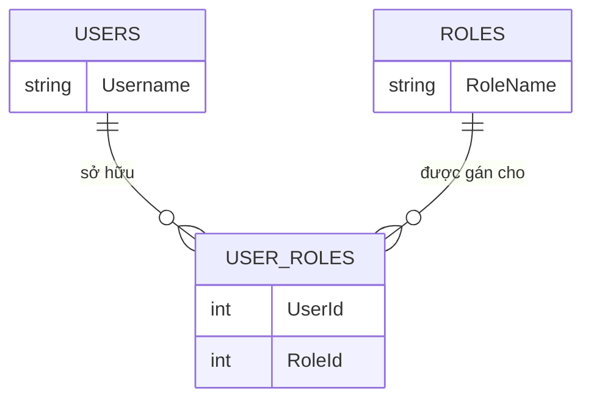
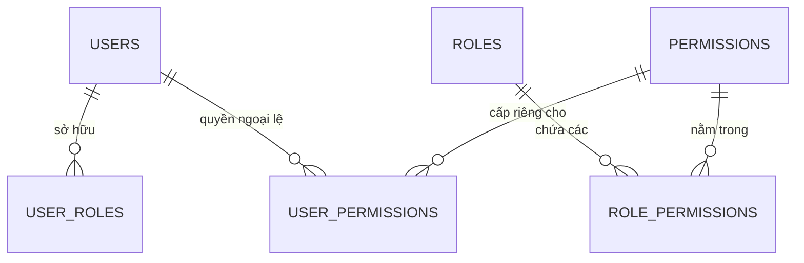
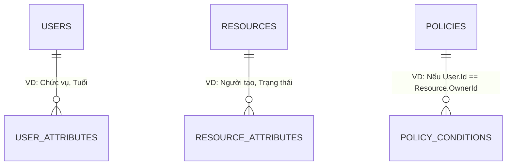
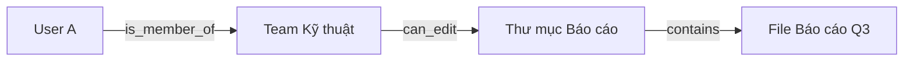
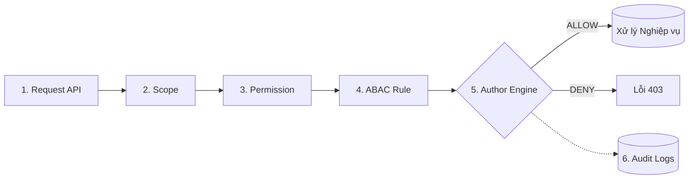

# 🚀 KỊCH BẢN THUYẾT TRÌNH BẢO MẬT & KIẾN TRÚC
**Chủ đề: Từ Code đến Container - Xây dựng & Triển khai Hệ thống Quản lý Tin tức chuẩn Enterprise**

---

## TỔNG QUAN HỆ THỐNG (Giới thiệu)
*Kính chào quý thầy cô / các anh chị. Hôm nay em xin trình bày về dự án Hệ thống Quản lý Tin tức.*
*Hệ thống này được xây dựng trên .NET Core API và Docker. Tuy nhiên, điểm nhấn lớn nhất mà em muốn tập trung phân tích hôm nay không phải là các chức năng Thêm/Sửa/Xóa thông thường, mà là **Kiến trúc Bảo mật và Phân quyền** - trái tim của mọi hệ thống chuẩn Enterprise.*

---

## PHẦN 1: BÀI TOÁN BẢO MẬT & PHÂN QUYỀN (Authentication & Authorization)

### 1.1. Định danh (Authentication - Xác thực người dùng)
*Để xác định "Người đang truy cập là ai?", chúng ta dùng 2 phương pháp là Session/Cookie và JWT. Trong dự án này, em chọn JWT vì những lý do sau:*

- **Mô hình Session/Cookie truyền thống:** Khi User đăng nhập, Server tạo ra 1 "phiên" (Session) lưu trên RAM của Server, và trả về cho trình duyệt một ID (Cookie). 
  - *Nhược điểm:* Rất nặng Server. Nếu trang báo có 100.000 người online, RAM Server sẽ cạn kiệt. Việc mở rộng (Scale) ra nhiều Server rất khó vì phải đồng bộ Session.
- **Mô hình JWT (JSON Web Token):** Đây là thẻ định danh không trạng thái (Stateless).
  - *Cấu trúc của JWT gồm 3 phần:*
    1. **Header (Đầu):** Chứa thông tin về thuật toán mã hóa (VD: HS256).
    2. **Payload (Thân):** Chứa thông tin của User (ID, Email, Quyền hạn...). Phần này ai cũng có thể giải mã để đọc, nên tuyệt đối không lưu mật khẩu ở đây.
    3. **Signature (Chữ ký):** Được Server băm ra bằng một "Chìa khóa bí mật" (Secret Key). Bất kỳ ai sửa đổi Payload thì Chữ ký sẽ bị sai lệch.
  - *Ví dụ thực tế:* JWT giống như "Căn cước công dân" có đóng dấu chìm của Nhà nước. Đi qua trạm gác (API), bảo vệ chỉ cần nhìn cái dấu chìm (Signature) là biết căn cước thật hay giả, không cần phải gọi điện về trụ sở (Database) để tra cứu hồ sơ nữa. Điều này giúp Server giảm tải cực lớn!

### 1.2. Sự tiến hóa của các mô hình Phân quyền (Authorization)
*Nếu Authentication (Định danh) là việc cấp "Chìa khóa" để bước qua cổng công ty, thì **Authorization (Phân quyền)** là việc quyết định anh được phép đi vào những căn phòng nào và làm gì trong công ty đó.*

*Việc phân quyền không đơn giản là kiểm tra if-else. Để tìm ra kiến trúc tối ưu nhất, ngành kỹ thuật phần mềm đã trải qua sự tiến hóa với 4 mô hình sau:*

#### Mô hình 1: RBAC (Role-Based Access Control) - Phân quyền theo Vai trò

- **Bản chất:** Gắn cứng quyền truy cập vào một "Chức danh". (VD: `[Authorize(Roles="Writer")]`).
- **Ưu điểm (Dễ triển khai):** 
  - *Dẫn chứng:* Khi phòng Nhân sự tuyển 10 phóng viên mới, Admin chỉ cần gán cả 10 người vào Role `Writer` là xong. Code API rất đơn giản.
- **Nhược điểm (Sự cứng nhắc & Role Explosion):**
  - *Dẫn chứng:* Giả sử có 1 Thực tập sinh mảng nội dung cần quyền "Duyệt bài" tạm thời trong 1 tuần. Lập trình viên không thể gán Role "Giám đốc" cho cậu ta. Buộc phải tạo ra một Role lai tạp là `ThucTapSinh_DuocDuyetBai`. Hệ thống dùng 5 năm sẽ đẻ ra hàng trăm Role rác, code C# ngập tràn các lệnh if-else rối rắm.

#### Mô hình 2: PBAC (Permission-Based Access Control)

- **Bản chất:** Không kiểm tra Chức danh, mà kiểm tra "Giấy phép" (`[HasPermission("Approve_News")]`). Role lúc này chỉ là cái vỏ gom nhóm. Bảng `USER_PERMISSIONS` sinh ra để giải quyết quyền ngoại lệ.
- **Ưu điểm (Linh hoạt tuyệt đối):**
  - *Dẫn chứng:* Sếp yêu cầu cấp quyền duyệt bài cho Thực tập sinh. Admin chỉ cần mở giao diện Web, tích vào ô "Approve_News" riêng cho tài khoản đó (Lưu vào `USER_PERMISSIONS`). **Mã nguồn C# không thay đổi một dòng nào, không cần Rebuild Server!**
- **Nhược điểm (Mù lòa về dữ liệu - Data Blindness):**
  - *Dẫn chứng:* Nhân viên A và Nhân viên B đều có quyền `Edit_News`. Nhân viên A có thể bắt gói tin API, đổi ID bài viết và **SỬA BÀI CỦA NHÂN VIÊN B**. PBAC không biết cách phân biệt "Bài của ai", dẫn đến lỗ hổng bảo mật nghiêm trọng (IDOR).

#### Mô hình 3: ABAC (Attribute-Based Access Control)

- **Bản chất:** Đánh giá quyền dựa trên 4 Thuộc tính: User, Dữ liệu, Hành động, Môi trường.
- **Ưu điểm (Kiểm soát siêu mịn - Fine-grained):**
  - *Dẫn chứng:* Giải quyết hoàn toàn nhược điểm của PBAC. Bộ luật ABAC quy định: `Chỉ cho UPDATE NẾU User.Id == Article.AuthorId`. Ngay lập tức, Nhân viên A không thể sửa bài của Nhân viên B nữa.
- **Nhược điểm (Sát thủ hiệu năng & Phức tạp):**
  - *Dẫn chứng:* Để duyệt 1 request, hệ thống phải query DB lấy thuộc tính User, query DB lấy thuộc tính Bài viết, check đồng hồ Server, rồi chạy Engine logic. Gây trễ (latency) lớn và cực kỳ khó setup Database cho linh hoạt.

#### Mô hình 4: ReBAC (Relationship-Based Access Control)

- **Bản chất:** Phân quyền dựa trên Đồ thị mối quan hệ (Cơ chế Google Zanzibar).
- **Ưu điểm (Đỉnh cao bài toán Chia sẻ):**
  - *Dẫn chứng:* Khi dùng Google Drive, bạn share 1 Thư mục cha cho 100 người, thì hàng ngàn thư mục con bên trong lập tức ăn theo quyền mà không bị lag.
- **Nhược điểm (Overkill):**
  - *Dẫn chứng:* Hệ thống Tin tức thường phẳng (Phóng viên viết -> Sếp duyệt), không có tính chất chia sẻ lồng nhau (nesting) như Drive. Dùng ReBAC ở đây là lãng phí tài nguyên hạ tầng.

#### 📊 Bảng so sánh tổng hợp đa chiều
| Tiêu chí | RBAC (Role) | PBAC (Permission) | ABAC (Attribute) | ReBAC (Relationship) |
| :--- | :--- | :--- | :--- | :--- |
| **Bản chất hoạt động** | Check Tên Role | Check Tên Quyền | Chạy Logic Thuộc tính | Duyệt Đồ thị Graph |
| **Chi phí bảo trì Code** | Cao (Hay sửa code) | Cực thấp (Động 100%) | Trung bình (Tùy Engine) | Cao (Phụ thuộc SaaS) |
| **Kiểm soát Sở hữu dữ liệu**| ❌ Bất lực | ❌ Bất lực | ✅ Hoàn hảo | ✅ Tốt |
| **Hiệu năng (Performance)** | 🚀 Nhanh nhất | 🚀 Rất nhanh | ⚠️ Chậm (Nhiều Query) | ⚡ Siêu nhanh (Đồ thị) |

---

### 1.3. Giải pháp thực tế: Kiến trúc Phân quyền Đa lớp (Zero Trust Pipeline)

*Từ bảng phân tích trên, lập luận cốt lõi của em là: **Không có mô hình đơn lẻ nào là hoàn hảo**. Do đó, kiến trúc em áp dụng là sự **KẾT HỢP** những điểm mạnh nhất của các mô hình trên, tạo thành **Đường ống Zero Trust 6 thành phần**:*

#### Giải phẫu 6 thành phần:
1. **RBAC (Quản lý Role):** Giữ lại sự tiện lợi cho HR gom nhóm nhân sự.
2. **PBAC (Quản lý Action):** Dùng để Code API, đảm bảo tách bạch Logic Code và Tổ chức Nhân sự.
3. **Scope (Giới hạn thiết bị):** Giới hạn rủi ro từ thiết bị di động/bên thứ 3.
4. **ABAC (Xử lý điều kiện Dữ liệu):** Bọc màng lọc sát Data để ngăn IDOR (chỉ sửa bài của mình).
5. **Author Engine (Cỗ máy Quyết định):** Trung tâm phán xử trung gian chạy 4 luật trên chốt hạ ALLOW/DENY.
6. **Audit (Truy vết):** Ghi lại mọi hành động và lý do bị chặn phục vụ điều tra.

#### Phân tích Ưu & Nhược điểm:
- **🌟 Ưu điểm tối thượng (Bảo mật vô khuyết):**
  - *Dẫn chứng:* Kể cả khi Hacker trộm được Token của Giám đốc, mang lên thiết bị lạ (Vi phạm Scope) -> Bị chặn. Vượt qua Scope, định sửa bài của người khác (Vi phạm ABAC) -> Bị chặn. An toàn tuyệt đối!
- **⚠️ Nhược điểm & Đánh đổi:**
  - *Độ trễ (Latency):* Việc check cả Permission và ABAC làm API chậm đi. *Dẫn chứng/Giải pháp:* Dùng **Redis Cache** để lưu sẵn Permission trên RAM.
  - *Khó Debug:* Khi User bị lỗi 403, Dev không biết bị kẹt ở lớp nào. *Dẫn chứng/Giải pháp:* Nhờ thành phần **Audit Log**, mọi lý do Reject đều được ghi rõ, khắc phục hoàn toàn nhược điểm vận hành.

---

## PHẦN 2: BÀI TOÁN QUẢN LÝ TIN TỨC (Nghiệp vụ cốt lõi)

*(Đọc Script thuyết trình)*
*"Kính thưa Hội đồng, sau khi đã xây dựng xong bức tường thành bảo mật vững chắc ở Phần 1, việc triển khai nghiệp vụ cốt lõi ở Phần 2 trở nên vô cùng rõ ràng và trơn tru.*

*Hệ thống Tin tức được thiết kế với các thực thể cốt lõi như `Article` (Id, Tiêu đề, Nội dung, Tác giả, Trạng thái) và `Category` (Chuyên mục). Nhờ có kiến trúc Author Engine Đa lớp chặn ở vòng ngoài, trải nghiệm của lập trình viên (Developer Experience) khi code các API này là cực kỳ tuyệt vời!*

*Code C# bên trong Controller của chúng em hiện tại vô cùng 'Sạch' (Clean Code). Chúng em hoàn toàn không phải viết bất kỳ câu lệnh `if-else` lặp đi lặp lại nào để kiểm tra xem User có quyền sửa bài không, hay đây có phải bài của họ không. Mọi rác rưởi logic đó đã được màng lọc ABAC và PBAC lo liệu.*

*Lập trình viên lúc này chỉ tập trung 100% chất xám vào Logic Kinh Doanh: Viết các câu truy vấn LINQ bằng Entity Framework Core để Thêm, Sửa, Xóa, Lọc tin tức, và Phân trang (Pagination) sao cho tối ưu tốc độ nhanh nhất có thể. Khối kiến trúc này giúp dự án dễ bảo trì và dễ scale-up đội ngũ Dev sau này."*

---

## PHẦN 3: ĐÓNG GÓI ỨNG DỤNG (Containerization với Docker)

### 3.1. Docker là gì và Tác dụng của Docker?
*Trước khi nói về cách áp dụng, em xin tóm tắt ngắn gọn tại sao hệ thống của chúng ta bắt buộc phải dùng Docker.*

*Từ trước đến nay, nỗi ám ảnh lớn nhất của các lập trình viên là: **"Code chạy rất ngon trên máy của em, nhưng khi đưa lên Server thì lại sập!"**. Nguyên nhân là do lệch phiên bản Hệ điều hành (Windows vs Linux), thiếu thư viện SDK, hoặc cài đặt môi trường sai.*

*Và **Docker** ra đời để giải quyết triệt để nỗi đau đó. Nó giống như một chiếc Container chở hàng. Docker đóng gói toàn bộ Mã nguồn (Code) + Môi trường chạy (.NET Runtime) + Cấu hình... vào chung một cái hộp duy nhất (gọi là Image). Cái hộp này khi bê đi máy Mac, máy Windows, hay lên Cloud Linux thì đều chạy chính xác 100% giống hệt nhau.*

### 3.2. Áp dụng thực tế (Docker Multi-stage Build)
- *Dẫn chứng:* Trong dự án này, em đã viết file `Dockerfile` áp dụng kỹ thuật **Multi-stage Build**. Tức là: Dùng image `sdk` (hàng GB) để compile code ra file chạy, sau đó chỉ copy những file chạy đó sang một image `aspnet` (chỉ chứa runtime). Kết quả là dung lượng hệ thống giảm từ 1GB xuống chỉ còn khoảng 200MB, tối ưu tốc độ tải về máy chủ một cách kinh ngạc.

---

## PHẦN 4: PHÂN PHỐI & TRIỂN KHAI (Docker Hub & Docker Compose)
- **Phân phối:** Chạy lệnh `docker build` và đẩy Image lên Docker Hub, sẵn sàng cho mọi Server tải về.
- **Triển khai với Docker Compose:**
  - Viết file `docker-compose.yml` định nghĩa 2 dịch vụ: `api_service` và `db_service`.
  - Giải thích khái niệm **Docker Volumes** (Giữ an toàn dữ liệu tin tức và User khi tắt Docker) và **Docker Networks** (Để API kết nối an toàn với DB nội bộ, cô lập khỏi internet).

---

## PHẦN 5: LIVE DEMO & KẾT LUẬN (Showtime)
- **Bước 1 (DevOps):** Gõ `docker-compose up -d`. Vài giây sau, hệ thống đứng dậy thành công.
- **Bước 2 (Kiểm chứng Zero Trust Pipeline):** 
  1. *Test Scope:* Gọi API bằng Token của App Khách -> Chặn ngay cửa số 1.
  2. *Test PBAC:* Login tài khoản `Reader` -> Bị chặn ở cửa 2 (Thiếu Permission).
  3. *Test ABAC:* Login `Writer`, truyền láo ID bài báo của người khác -> Lọt cửa 2, bị chặn cửa 3.
  4. *Thành công:* Sửa bài của chính mình -> `200 OK`. Lịch sử Audit ghi log hoàn chỉnh.

> **KẾT LUẬN:** *"Hệ thống đã giải quyết trọn vẹn từ bảo mật vòng ngoài, logic phân quyền Đa lớp bên trong, cho đến quy trình đóng gói tự động hóa DevOps. Em xin kết thúc bài trình bày ạ."*
