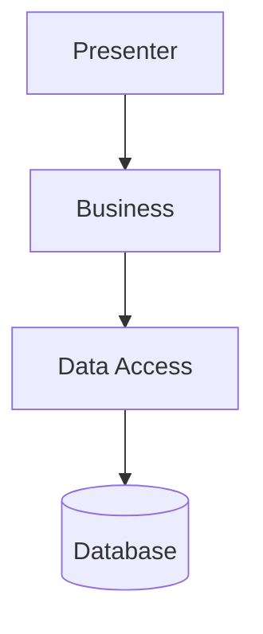
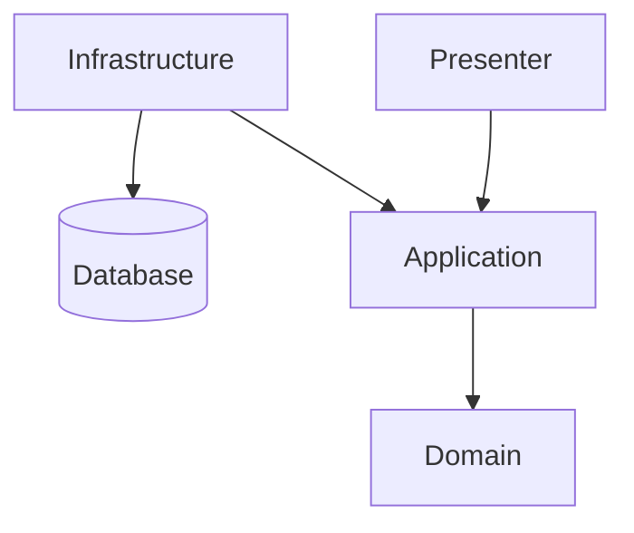
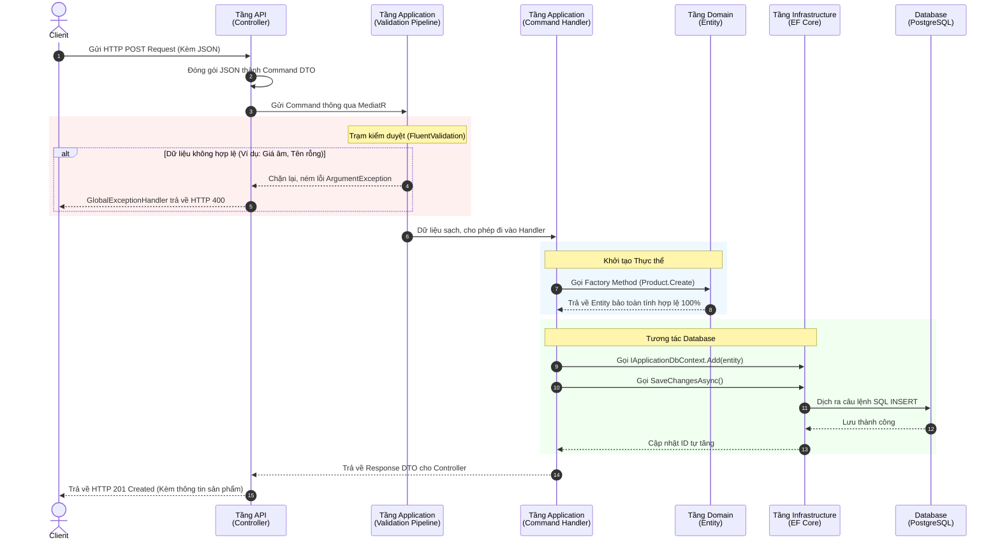

# Kịch Bản Thuyết Trình: Giải Phẫu Clean Architecture Trong .NET 10

Xin chào mọi người. Hôm nay, em sẽ trình bày về project demo C# .NET 10 sử dụng Clean Architecture.

## Mục Lục
**I. Lý thuyết Kiến trúc (Architecture)**
- Tại sao cần Architecture?
- Khái niệm 4 tầng của Clean Architecture (Domain, Application, Infrastructure, Presentation)
- So sánh 3 mô hình phổ biến: N-Layer, Microservices, Clean Architecture

**II. Project Demo (Cấu trúc & Luồng dữ liệu)**
- Tổng quan cây thư mục Project
- Sơ đồ luồng đi của 1 Request (CQRS, MediatR, Validation Pipeline)

**III. Demo API Thực tế**
- Tích hợp OAS3 với Postman & Scalar UI
- Chạy thử API tạo sản phẩm

**IV. Q&A (Hỏi Đáp kỹ thuật)**

---

## 1.1 Tại sao cần Architecture?
Đầu tiên em sẽ nói về việc tại sao chúng ta cần architecture?
Ví dụ khi chúng ta phát triển phần mềm mà cần cập nhật lại các business rule, logic hoặc thêm tính năng mới hay là thay đổi tính năng này thì chúng ta sẽ thấy khó để có thể thực hiện, khó mở rộng. Đấy là những vấn đề chúng ta sẽ gặp phải khi chúng ta code mà không sử dụng kiến trúc:
- khó bảo trì
- khó thêm tính năng mới
- dễ lỗi khi thay đổi
- khó kiểm thử

## 1.2 Điều gì xảy ra khi không có Architecture ?
Từ những vấn đề gặp phải này sẽ dẫn tới các hậu quả không mong muốn như:
- sửa nhiều chỗ trong ứng dụng
- logic nằm rải rác, dính chặt với UI hoặc DB
- phải đập đi xây lại từng phần vì kiến trúc ban đầu không linh hoạt
- tốn thời gian, phát sinh bug

## 1.3 Thế nào là "Architecture" sạch?
Vậy nên chúng ta cần một kiến trúc sạch, đủ sạch để:
- dễ thay đổi
- dễ bảo trì
- khả năng tái sử dụng cao
- dễ kiểm thử

## 1.4 CLEAN ARCHITECTURE
=> Clean Architecture, do ông Robert Sim giới thiệu vào năm 2012 và là một trong những kiến trúc phổ biến.
Robert C. Martin đã đưa ra Clean Architecture với mục tiêu tối thượng là Sự độc lập: Độc lập với Framework, UI, và Database. Chúng ta có thể Test toàn bộ quy trình nghiệp vụ mà không cần bật Web Server hay Database thật lên.

## 1.5 CLEAN ARCHITECTURE LÀ GÌ ?
Về cơ bản thì clean architecture là loại kiến trúc đa tầng đa lớp và gồm 4 lớp đó là: Presentation, Infrastructure, Application và Domain.

## 1.6 DOMAIN LAYER
Đầu tiên chúng ta sẽ nói về lớp trong cùng đó là Domain. Đây là tầng trong cùng (tầng cốt lõi). Nó chứa các quy tắc nghiệp vụ cấp doanh nghiệp—những quy tắc vẫn tồn tại ngay cả khi không có hệ thống phần mềm nào.
- **Entities (Thực thể):** Các đối tượng có định danh riêng. *(Thao tác: Mở file `Product.cs`)*. Em thiết kế nó theo dạng "Rich Entity", có hàm `Create()` tự đóng gói nghiệp vụ kiểm tra tính hợp lệ (giá tiền không âm) bên trong chính nó.
- **Value Objects (Đối tượng giá trị):** Các đối tượng bất biến (immutable), được xác định duy nhất bằng giá trị của chúng (ví dụ: Colour, Money).
- **Domain Events (Sự kiện miền):** Những việc/sự kiện đã diễn ra trong phạm vi nghiệp vụ.
- **Enumerations (Kiểu liệt kê):** Các kiểu liệt kê định kiểu mạnh (strongly typed). Chẳng hạn như file `ProductCategory.cs` chứa (Electronics, Clothing...).
- **Exceptions:** Chứa các lỗi nghiệp vụ cốt lõi như `NotFoundException`.
Hoàn toàn không phụ thuộc vào bất kỳ tầng nào khác hay bất kỳ framework của bên thứ ba nào.

## 1.7 APPLICATION LAYER
Tiếp theo là lớp Application. Tầng này đảm nhiệm điều phối các ca sử dụng (use cases) của hệ thống. Chỉ phụ thuộc vào tầng Domain.
- **Commands (Lệnh):** Các thao tác làm thay đổi dữ liệu (tạo mới, cập nhật, xóa).
- **Queries (Truy vấn):** Các thao tác chỉ đọc dữ liệu và trả về kết quả.
- **Handlers (Bộ xử lý):** Thực thi commands và queries thông qua MediatR. *(Thao tác: Mở file `AddProductCommand.cs` để show cả Command và Handler)*
- **Interfaces (Giao diện trừu tượng):** Các lớp trừu tượng hóa dành cho tầng Infrastructure (ví dụ: `IApplicationDbContext`).
- **Validators (Bộ kiểm thực):** Các quy tắc kiểm tra tính hợp lệ bằng FluentValidation cho commands/queries. *(Thao tác: Mở file `AddProductCommandValidator.cs`)*
- **Pipeline Behaviours:** Xử lý các mối quan tâm xuyên suốt / dùng chung (cross-cutting concerns như validation, logging, đo hiệu năng). *(Thao tác: Mở file `ValidationBehavior.cs`)*

## 1.8 PRESENTATION LAYER
Cuối cùng là lớp Presentation (API). Điểm bắt đầu (entry point) của toàn bộ hệ thống.
- **Endpoints:** Các Controller API tinh gọn, chỉ làm nhiệm vụ nhận Request và đẩy cho MediatR.
- **Middleware:** Xử lý lỗi tập trung bằng `GlobalExceptionHandler`, tự động trả về định dạng chuẩn ProblemDetails.
- **OpenAPI / Scalar:** Tài liệu hóa API hiện đại thay thế cho Swagger cũ.

## 1.9 INFRASTRUCTURE LAYER
Sau Application là Infrastructure. Tầng này implement các interface đã được định nghĩa ở Application.
- **DbContext:** Cài đặt EF Core kết nối PostgreSQL.
- **Entity Configuration (Fluent API):** Tách toàn bộ các cấu hình bảng ra file riêng để tầng Domain luôn sạch sẽ.
- **DependencyInjection.cs:** Gói gọn cấu hình Database, giúp tầng API không cần biết cấu hình ngầm của cơ sở dữ liệu.
- **External Services (Dịch vụ bên ngoài):** Tích hợp gửi email, lưu trữ tệp (storage), và các client gọi API bên thứ ba. *(Ghi chú: Project demo hiện tại chỉ tập trung vào DB, nhưng nếu có gửi email, code sẽ nằm ở tầng này).*

## 1.10 Tại sao lại chọn cấu trúc này?
Mỗi tầng đều có một trách nhiệm duy nhất và một ranh giới phân tách rõ ràng:
- **Dễ kiểm thử (Testable):** *(Thao tác: Mở file `AddProductCommandValidatorTests.cs`)* Logic được viết Unit Test độc lập hoàn toàn mà KHÔNG CẦN bật PostgreSQL.
- **Dễ thay thế (Replaceable):** *(Thao tác: Mở file `DemoC#.Infrastructure/DependencyInjection.cs`)* Nếu chuyển sang SQL Server, chúng ta chỉ việc xóa 1 dòng `UseNpgsql` và đổi thành `UseSqlServer`. Hàng ngàn dòng code ở Domain không hề biết về sự thay đổi này.
- **Dễ tra cứu & định vị (Discoverable):** Tổ chức theo vertical slices (thư mục Features). Muốn sửa API thêm sản phẩm, chỉ cần mở đúng 1 thư mục chứa Command, Handler và Validator.
- **Bền vững trước thay đổi (Stable under change):** *(Thao tác: Mở file `GlobalExceptionHandler.cs`)* Dù Client yêu cầu lỗi phải trả về JSON thay vì Crash server, Controller vẫn sạch sẽ không có lấy một khối `try...catch` nào nhờ có Middleware bọc ở ngoài cùng.

## 1.11 KIẾN TRÚC 3 LỚP TRUYỀN THỐNG (N-LAYER)
*(Thao tác: Trình chiếu Slide sơ đồ N-Layer)*



- **✅ Ưu điểm:**
  - **Dễ học, dễ setup:** Cực kỳ thân thiện với người mới tiếp cận lập trình.
  - **Phát triển siêu tốc:** Phù hợp để làm các dự án nhỏ, bài tập lớn, hoặc tạo các sản phẩm chạy thử (MVP) chỉ trong vài ngày.
- **❌ Nhược điểm:**
  - **Khó viết Unit Test** cho các business logic vì code gọi thẳng vào Database.
  - **Dính chặt vào Database (Tight Coupling):** Logic bị "rải rác" và phụ thuộc cứng vào tầng dưới (Data Access). Đổi Database gần như là đập đi làm lại.

## 1.12 KIẾN TRÚC VI DỊCH VỤ (MICROSERVICES)
*(Thao tác: Trình chiếu Slide sơ đồ Microservices)*

```mermaid
graph TD
    GW[API Gateway] --> M1[Microservice 1<br>(Product)]
    GW --> M3[Microservice 3<br>(User)]
    M1 -. Event Bus / HTTP .-> M2[Microservice 2<br>(Order)]
    M1 --> DB1[(DB 1)]
    M2 --> DB2[(DB 2)]
    M3 --> DB3[(DB 3)]
```

- **✅ Ưu điểm:**
  - **Khả năng mở rộng (Scale) vô cực:** Traffic tăng chỗ nào, vứt thêm server vào chỗ đó. Rất phù hợp cho các hệ thống siêu lớn như Shopee, Netflix.
  - **Công nghệ tự do:** Team A có thể viết C#, Team B viết Node.js, miễn là nói chuyện được với nhau qua API.
- **❌ Nhược điểm:**
  - **Chi phí DevOps "chát":** Quản lý server, theo dõi log, deploy cực kỳ tốn tiền và mệt mỏi.
  - **Cực khó Debug:** Lỗi rớt mạng hoặc mất dữ liệu giữa 2 Service là ác mộng để dò tìm.

## 1.13 CLEAN ARCHITECTURE
*(Thao tác: Trình chiếu Slide sơ đồ Clean Architecture)*



- **✅ Ưu điểm:**
  - **Độc lập tuyệt đối:** UI, Database, Framework bị đẩy ra ngoài. Lõi nghiệp vụ sống "bất tử".
  - **Kiểm thử cực kỳ dễ dàng:** Viết Unit Test sướng vì có thể dùng Mock Database/Interface.
  - **Dễ bảo trì dài hạn:** Team to, dự án lớn càng làm càng thấy nhàn, code không bị nát theo thời gian.
- **❌ Nhược điểm:**
  - **Over-engineering:** Với một cái API "thêm sửa xóa" (CRUD) đơn giản, chúng ta vẫn phải đẻ ra cả đống file: Interface, DTO, Entity... rất cồng kềnh.
  - **Đường cong học tập cao:** Đòi hỏi lập trình viên phải hiểu sâu về Dependency Injection, Design Patterns.

## 1.14 SO SÁNH 3 MÔ HÌNH KIẾN TRÚC PHỔ BIẾN
Dưới đây là bảng tổng kết so sánh 3 kiến trúc để chúng ta thấy rõ Clean Architecture nằm ở đâu trên cán cân công nghệ:

| Tiêu chí | 3 Lớp Truyền Thống (N-Tier) | Clean Architecture | Microservices (Vi Dịch Vụ) |
| :--- | :--- | :--- | :--- |
| **1. Mức độ độc lập** | **Thấp** (Phụ thuộc chặt vào DB) | **Cao** (Lõi nghiệp vụ độc lập hoàn toàn) | **Rất Cao** (Độc lập cả về Server & Ngôn ngữ) |
| **2. Thời gian Setup** | **Siêu nhanh**, code được ngay | **Lâu** (Nhiều Boilerplate code, Interface) | **Cực lâu** (Setup hạ tầng mạng, DevOps) |
| **3. Khả năng Kiểm thử**| **Khó** (Vì dính chặt vào DB) | **Cực kỳ dễ** (Dễ dàng dùng Mock/Fake DB) | **Phức tạp** (Khó test tích hợp giữa các Services) |
| **4. Khả năng Mở rộng** | **Kém** (Phình to thành Monolith khổng lồ)| **Tốt** (Mã nguồn quy củ, team lớn không giẫm chân) | **Vô cực** (Nghẽn ở đâu, cắm thêm server ở đó) |
| **5. Khả năng Bảo trì** | **Ác mộng** (Sửa 1 chỗ, hỏng 10 chỗ) | **Nhàn hạ** (Code tự "kể chuyện", dễ dò bug) | **Đòi hỏi cao** (Cần trình độ DevOps giỏi để vận hành) |
| **6. Khi nào nên dùng?** | Web nhỏ, Startup làm bản chạy thử (MVP) | Dự án Doanh nghiệp, cần sống thọ, Logic phức tạp | Hệ thống khổng lồ cỡ Netflix, Shopee, Uber |

*Nhược điểm lớn nhất của Clean Architecture là nó đẻ ra quá nhiều file. Nó giống như việc dùng Dao mổ trâu để đi giết gà. Nếu em chỉ làm một cái web bán hàng bé tí, em sẽ dùng Kiến trúc 3 lớp cho nhanh. Nhưng nếu em xây dựng hệ thống Ngân hàng, hay một sản phẩm khởi nghiệp cần bảo trì trong 5-10 năm tới, thì chi phí phải viết nhiều file ban đầu của Clean Architecture hoàn toàn rẻ hơn gấp 100 lần so với chi phí đập đi xây lại hệ thống sau này!*

---

## 2.0 Project architecture & demo
Tại đây, hệ thống tuân thủ chặt chẽ nguyên lý Đảo ngược phụ thuộc (Dependency Inversion), API bao bọc ngoài cùng và gọi vào lõi Domain ở giữa.
Mọi người có thể thấy trên màn hình em đã chủ động chia Solution ra thành đúng **4 Project vật lý (DLL)** biệt lập thay vì chỉ tạo các thư mục đơn thuần bên trong một Project. 

Mục đích của việc phân tách này là để thiết lập **sự bảo vệ từ Trình biên dịch (Compile-time protection)**. Bằng cách thiết lập cấu hình tham chiếu (Project Reference) một chiều chặt chẽ, kiến trúc sẽ ép buộc toàn bộ team phải code đúng chuẩn. Bất kỳ một sự vi phạm nào—chẳng hạn như việc tầng Lõi (Domain) lỡ gọi nhầm thư viện của Database—sẽ bị Visual Studio báo lỗi đỏ và chặn đứng ngay từ lúc Build. Điều này đảm bảo dự án luôn "sạch sẽ" và không bị phá vỡ cấu trúc.
## 2.1 Project demo (Luồng đi của 1 request)
Để mọi người dễ hình dung, hãy cùng theo dõi luồng đi của một Request tạo mới sản phẩm:
1. Đầu tiên, Client gửi HTTP Request mang theo dữ liệu JSON. Tại tầng API, Controller đóng gói dữ liệu đó thành một **Record DTO** an toàn (`AddProductCommand`).
2. Thay vì gọi Service thông thường, Controller ném Command này cho **MediatR**.
3. MediatR đưa dữ liệu qua một "Trạm kiểm duyệt" là **ValidationBehavior** (Pipeline). Nếu luật lệ vi phạm (giá âm, tên rỗng), nó chặn lại ngay và ném lỗi 400 ra GlobalExceptionHandler.
4. Nếu dữ liệu hợp lệ 100%, nó tiến vào **CommandHandler**. Entity `Product` tự khởi tạo chính nó bằng quy tắc nghiệp vụ chặt chẽ.
5. Cuối cùng, Handler gọi trực tiếp vào `IApplicationDbContext`. Tầng Infrastructure ngầm dịch nó thành SQL tối ưu và lưu thẳng vào PostgreSQL.
Toàn bộ quá trình diễn ra nhịp nhàng: Lõi nghiệp vụ được bảo vệ tuyệt đối, mã nguồn gọn nhẹ vì loại bỏ được lớp Repository thừa thãi.

*(các anh chị có thể xem sơ đồ dưới đây để thấy rõ đường đi của dữ liệu)*



---

## 3.0 Hướng dẫn Import OAS3 vào Postman (Và sự hỗ trợ của Scalar UI)
Thay vì phải ngồi gõ tay từng đường dẫn URL, nhập từng cái header hay tự phác thảo body JSON rất mất thời gian, chúng ta tận dụng sức mạnh của file cấu hình OAS3.
Mọi người chỉ cần copy đường dẫn `https://localhost:<port>/openapi/v1.json` khi chạy API, mở **Postman** lên và bấm Import. Ngay lập tức Postman nhận diện tài liệu chuẩn OpenAPI 3.1.
Ngoài ra, Project còn tích hợp sẵn giao diện **Scalar UI**. Không cần bật Postman, Mọi người có thể xem ngay Docs và Test API trực tiếp trên trình duyệt với các mẫu JSON đã được định nghĩa cực kỳ trực quan!

## 3.1 Kết quả & Chạy thử API thực tế
*(Thao tác: Mở Postman hoặc Scalar UI để demo)*
Ngay khi Import, Postman/Scalar tự động sinh ra toàn bộ Collection với đầy đủ API GET, POST, PUT, DELETE.
Em đã chạy thử API `POST /api/Product`. Nhập dữ liệu và bấm Send. Hệ thống xuyên qua 4 tầng kiến trúc (Controller -> MediatR Handler -> DbContext -> PostgreSQL) và trả về trạng thái `201 Created` rất mượt mà. Nhờ Clean Architecture kết hợp OAS3, Frontend và Tester không bao giờ phải cãi nhau với Backend về việc API yêu cầu truyền lên dữ liệu gì nữa, mọi thứ minh bạch 100%!

---

## 4.0 Q&A
Cảm ơn các anh chị và mọi người đã theo dõi. Em xin phép bắt đầu phần hỏi đáp!
